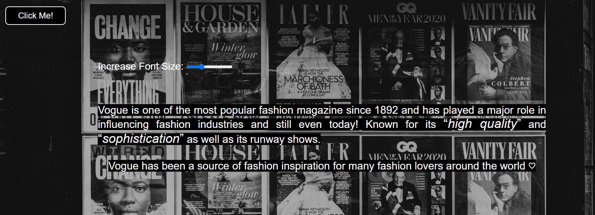

# Svelte

## Fundamentals of Web Development

## Website: Lucky’s Website

## Topic: Fashion Magazine Website

## Description

My website which I named, <i>"Lucky's Website"</i>, is a fashion magazine website that provides users with fashion related content. It is built using the code editor called 'Visual Studio Code' where I used HTML, CSS, Javascript and a web framework called 'Svelte'. This website is designed to be responsive in order to adapt to different devices with different screen sizes. Moreover, the website is also very easy to navigate, making it user-friendly and enjoyable to use as the website follows the typical horizontal navigation menu, consisting of a 'Home' page, an 'About' page, a dropdown menu for the 'Pages' and a dropdown menu for the 'Socials'. Not only it is user-friendly, but it also has a simple, yet modern look due to its black & white palette, allowing its content to become more visible, catching users' attention. It also contains animations, a slideshow and other interactive aspects in order to be considered 'visually appealing' and it also follows the usability heuristics which I used as a guide in order to create an attractive, yet functional website.

## Installation Steps

1. Clone repository
2. Install the dependencies using **npm install**
3. Display Website using **npm run dev -- --open**

## Inspirations from 3 sites(What elements did you like? Why?)

### Website #1: [Halo Media Website](https://halomedia.com/)
1. **Sans-serif fonts**

I chose the sans-serif fonts to incorporate into my website. This is because according to my research, sans-serif fonts are more ‘friendly’ and ‘approachable’ which is an effect I want my website to have. On the other hand, serif fonts are considered to be 'classic’ and ‘elegant’ and are ideal if you want to make your website appear ‘serious’. In addition, sans-serif fonts are considered to be more legible than serif fonts as they are more ‘clean’ and ‘simple’ due to its lack of ‘curls’ and additional ‘lines.’ This increased readability makes it ideal for people who have dyslexia or reading difficulties to read the text, which is also a feature I want in order to increase the accessibility of my website. As a result, I will use the font, ‘Arial’, as it is one of the fonts that appears ‘less crowded’. 

2. **Multiple Images**

Multiple images in large sizes attract users’ attention thus making them more involved. Too much text may irritate the users. Furthermore, for my images, I decided to make all of them have rounded corners as not only are they ‘easy on the eyes’, but rounded corners also gave a more ‘warm’ and ‘friendly’ impact in comparison to images with sharp edges. 

3. **Animation**

Animation is also a feature I want to incorporate into my website. Animations such as, zooming in an image when hovered and text animation such as the ‘fly animation’ to make the text appear vertically will make my website look ‘visually appealing’ and catch the user’s attention. It will also allow my website to share information in a more fun and memorable way. However, I plan not to use too much animation as based on my research, too much animation can distract and even annoy users.

### Website #2: [Selected Website](https://selectedbase.com/)
1. **Large font size** 

I want to use relatively large font sizes to make the text easy to read but not too large that it takes up a lot of space in the website. This is so that it catches users’ attention. I will also try to display less text as people do not want to read a long, daunting paragraph.

2. **Black & White colors** 

The black & white color palette makes the website have a minimalistic yet modern look.  Not only do the black & white colors promote simplicity but it also creates a bold contrast and makes the visual elements such as the pictures and text stand out more, which is a feature I want to incorporate into my website. 

### Website #3: [Ana Deufont - Portfolio Photography Website](https://polite-hill-00eb08f10.1.azurestaticapps.net/)
1. **Navigation Buttons**

Buttons increase interactivity between the users and the site. For my website, I will make a ‘Next’ button in order for the user to go to the next page as well as a ‘Go Back’ button so that the user can go back to the previous page whenever they like which supports one of the usability heuristics known as ‘User Control & Freedom’. This feature will make my website to behave more like a magazine which is what I intended to do. Also, I am going to set the cursor to a 'pointer' to make the buttons appear clickable.

2. **Slideshow**

I want to incorporate this into my website as another interactive aspect. Also, it will increase user engagement in terms of the visual aspect of the site. It is also another way to display multiple images on a single page which saves up space.

## Other Features:
1. **Main Page**

In the main page, I added an additional interactive aspect by adding a greeting based on the local time and a textbox that asks the user’s name and displays it. After clicking ‘continue’, it goes to the next section ‘smoothly’ and the name added will be saved to the storage and will not change unless the user changes it.

2. **Slider**

I made a slider that increases and decreases the font size of the text in the second page so that users can resize the text based on their preferences. This allows users to have more control and also increases the website accessibility, especially for users with reading difficulties.

## Bugs
No bugs found.

## References:
https://www.awwwards.com/ (Website Inspirations)

https://unsplash.com/ (Pictures)

https://developer.mozilla.org/en-US/ (MDN Web Doc)

https://svelte.dev/ (Svelte)

https://svelte.dev/tutorial/basics (Svelte Tutorials)

https://unsplash.com/developers (Unsplash Developers)

### Research for Website Design

https://designmodo.com/rounded-corners/ (Rounded Corners in Images)

https://www.impactplus.com/blog/sans-serif-vs-serif-font-which-should-you-use-when (Font style)

https://www.bdadyslexia.org.uk/advice/employers/creating-a-dyslexia-friendly-workplace/dyslexia-friendly-style-guide#:~:text=Readable%20fonts,may%20request%20a%20larger%20font. (Dyslexia Friendly Fonts)

https://www.studiorubric.co/blog/insight/font-size-matters-why-you-should-design-with-a-larger-font (Font Size)

https://boldist.co/web-design/using-animations-in-web-design/ (Animation)

### Usability Heuristics

https://www.nngroup.com/articles/ten-usability-heuristics/

### Bug Solution

https://developer.mozilla.org/en-US/docs/Web/API/Window/localStorage (Web Storage)

https://rodneylab.com/using-local-storage-sveltekit/ (Local Storage - Sveltekit)

https://svelte.dev/repl/a5bc00c245964b27bc750c1e8fba5bae?version=3.44.1 (Input Validation)

https://regexr.com/ (Regex)

### Other Features
https://developer.mozilla.org/en-US/docs/Web/JavaScript/Reference/Global_Objects/Date/getHours (Greetings based on local time feature)

https://rodneylab.com/svelte-social-icons/ (Social Media Icons)

### Media Queries
https://developer.mozilla.org/en-US/docs/Web/CSS/Media_Queries/Using_media_queries
